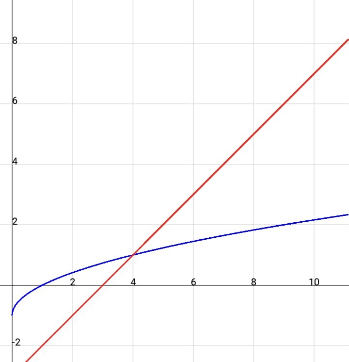

# Introdução aos algoritmos

O estudo dos algoritmos é importante para a computação para que possamos programar softwares viáveis para cada situação e que realize tarefas com a mais alta performance.
Estudar algoritmos fornece para o programador, noção fundamentalmente pura da estrutura de dados de seu trabalho de forma a deixar os defeitos de programação mais visíveis e portanto, reparáveis.

Vamos começar compreendendo o que de fato, é um algoritmo:

> Um algoritmo é um procedimento computacional que leva algum valor, ou conjunto de valores, como entrada e retorna algum valor, ou conjunto de valores, como resultado. Um algoritmo é, portanto, uma sequência de etapas computacionais que transformam a entrada na saída.

Por exemplo, podemos criar um algoritmo que inverte a sequência de uma lista:

```
def InverterLista(lista):
    tamanhoDaLista = len(lista)
    metadeDoTamanhoDaLista = tamanhoDaLista//2
    for item in range(metadeDoTamanhoDaLista):
        aux = lista[item]
        lista[item] = lista[(tamanhoDaLista - 1) - item]
        lista[(tamanhoDaLista - 1) - item] = aux
    return lista

```
Vamos analisar isto nos tópicos seguintes.

## Complexidade de espaço

Trata-se de quanto de espaço o algoritmo precisará para executar suas operações - isto inclui as variáveis existentes no mesmo. No caso de nosso exemplo, temos cinco variáveis contando com os argumentos da função ou a lista, portanto, a complexidade de espaço é equivalente a `4 + n`, sendo `n` os valores guardados na lista, afinal, a mesma guarda vários valores na mesma variável, que varia de acordo com a entrada.

## Complexidade de tempo

Uma maneira de calcular a complexidade de processamento seria encontrando alguma fórmula que dê o número exato de operações feitas pelo algoritmo.
O algoritmo empregado na função `InverterLista` possui 2 operações elementares em sua trajetória de execução e mais quatro outras que se repetem de acordo com o tamanho da lista que passamos de entrada. Matematicamente, podemos dizer que a quantidade de processamentos (a quantidade de operações contidas no nosso algoritmo) é o equivalente a `2 + 4(n/2)`, sendo `n/2` a quantidade de vezes que as quatro operações elementares do loop for em nosso algoritmo serão executadas. Como todo atencioso matemático sabe, isto tudo pode ser simplificado para: `2 + 2(n)` Observe, que tem relação de base direta com quanto tempo o algoritmo gasta de acordo com a entrada, pois independente do valor de entrada, a quantidade de etapas operacionais de nosso algoritmo sempre será a mesma, ou em outra forma de dizer, a base para calcular o tempo de processamento de qualquer tarefa para este algoritmo parte da mesma regra matemática, com independência de valores concretos.

# Verificando viabilidade de tempo

Vamos agora pôr o conceito de complexidade de algoritmo em prática. Para isso, temos a seguir duas soluções diferentes para um mesmo problema. A diferença entre ambos está no algorítmo empregado. Vamos analisar e decidir qual das soluções é mais viável:

### Problema:

Criar uma função que receba um número de entrada e retorne valor `verdadeiro` caso a entrada seja um número primo e valor `falso` caso a entrada seja um número composto.


### Solução primeira 
```
Se a entrada:
    * É maior que 1;
    * For divisível apenas por um e ela mesma.
a entrada é um número primo
```
Este algorítmo, em Python se assemelha com isto:
```
def fun1(n):
    if n > 1:
        for i in range(2, n - 1):
            if n % i == 0:
                return False
        return True
    return False
```

O funcionamento se baseia num laço que verifica se cada número de 2 até o antecessor da entrada é divisor da entrada.

Observe aqui, que no pior caso, a função `fun1` executará um total de `(n - 2) - 1` operações.

### Solução segunda

Já nesta solução, a estrutura de código é idêntica, porém o intervalo de verificação do laço é bem menor, pois o mesmo verifica se cada número de 2 até a raíz quadrada da entrada é divisor da entrada e a expressão `√x < x` é verdadeira. (Matematicamente, este método também é válido).

``` 
import math
def fun2(n):
    if n > 1:
        for i in range(2, int(math.sqrt(n))):
            if n % i == 0:
                return False
        return True
    return False
```

No pior caso, a função `fun2` executará um total de `int((√n)) - 1` operações.

|| Solução primeira | Solução segunda |
:---: | :---: | :---: |
Complexidade de tempo| `(n - 2) - 1` | `(√n) - 1` |
Resultado para `n = 11` |`(11 - 2) - 1 = 8`|`(√11 - 1) ≈ 2.3`|
Resultado para `n = 101` |`(101 - 2) - 1 = 98`|`(√101 - 1) ≈ 9.04`|
Resultado para `n = 10,e+10 + 19` |`(10,e+10 + 19 - 2) - 1 = 10,e+10 + 16`|`√(10,e+10 + 19) - 1 ≈ 10,e+5`|

Observe no gráfico, que o tempo gasto para a execução da primeira solução (vermelho), cresce exponencialmente em relação à complexidade da segunda solução (azul), ou em palavras que pareçam mais compatíveis com o gráfico, o tempo gasto pela segunda solução é exponencialmente menor que o gráfico da primeira solução.



Sendo assim, a última solução é a mais viável para resolver o problema.

## Referências

* Introduction to Algorithms por Thomas H. Cormen;
* [COMPLEXIDADE de ALGORITMOS I - Noção INTUITIVA](https://www.youtube.com/watch?v=KVlGx-9CuO4)
* [Princípios básicos | Complexidade de Algoritmos](https://www.youtube.com/watch?v=gRDl0VIhu4A)

